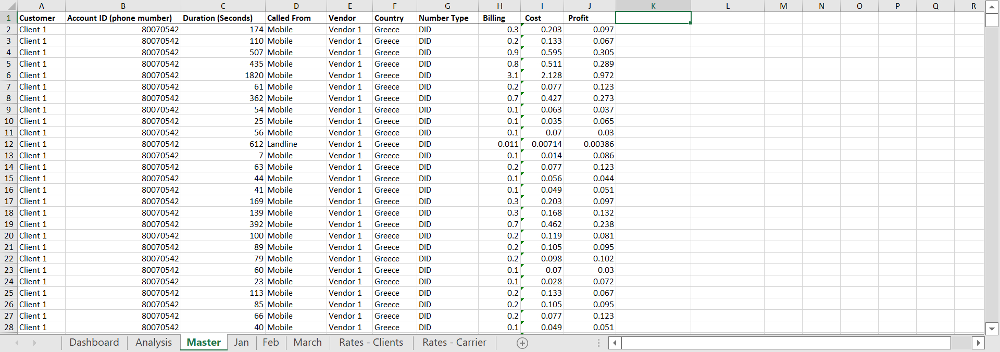

# Billing Analysis💵

Excel-based data analysis exercise I completed for an interview assessment. This is my first time handling the full data analysis workflow in Excel (before this I always used Pandas & Tableau), so I have to learn everything from scratch. The task was completed in 5 days.

## 📷 Sample Outputs
**Dashboard Overview**

**Master Data**

## 🔧 Task Overview
Analyze billing data and generate business insights from an Excel file with 5 tabs.
Each month contains call records in seconds, and vendors charge in different increments:
- Vendor 1: Every 6 seconds
- Vendor 2: Per second
- Vendor 3: Per minute
- Vendor 4: First 30 seconds, then every 6 seconds
- Vendor 5: Every 30 seconds

## 🧠 My Approach
**Transform**
- convert to table
- remove nulls
- combine all month
- get vendor, country, number type columns

**Statistics**
- calc billing 
- calc cost
- calc margins
- format these columns to currency
- delete rows where billing < $0.01

**Analysis**
- Total billing per client
- Gross Margins by Client %
- Total Cost per Vendor
- Gross Margins by Vendor%
- Gross Margins by Country %
- Gross Margins by Number %

**Dashboard**
- add slide bar and link all dynamic values to update upon rate increase

## 📊 Formulas Used
- =VLOOKUP(B2, 'Rates - Carrier'!A:F, 2, FALSE)
- =VLOOKUP(B2, 'Rates - Carrier'!A:F, 3, FALSE)
- =VLOOKUP(B2, 'Rates - Clients'!A:I, IF(D2="Landline",6,7), FALSE) * CEILING(C2/60, 1)
- =IF(E2="Vendor 1",
  CEILING(C2,6)*VLOOKUP(B2,'Rates - Carrier'!A:F,IF(D2="Landline",5,6),FALSE)/60,
IF(E2="Vendor 2",
  C2*VLOOKUP(B2, 'Rates - Carrier'!A:F, IF(D2="Landline",5,6), FALSE) / 60,
IF(E2="Vendor 3",
  CEILING(C2/60,1)*VLOOKUP(B2, 'Rates - Carrier'!A:F, IF(D2="Landline",5,6), FALSE) / 60,
IF(E2="Vendor 4",
  (CEILING(C2-30,6)+30) * VLOOKUP(B2, 'Rates - Carrier'!A:F, IF(D2="Landline",5,6), FALSE) / 60,
IF(E2="Vendor 5",
  CEILING(C2,30) * VLOOKUP(B2, 'Rates - Carrier'!A:F, IF(D2="Landline",5,6), FALSE) / 60,
"Error!")))))
- = [@Billing]-[@Cost]
- =D2 * (1 + $H$2 / 100)
- =E2 * (1 + $I$2 / 100)
- =Analysis!$B$54

## 📌 Summary of Findings
1. Profitability:
- Right now, the gross margin is 48%, which is above the target of 45%. To reach 45%, we would need to either lower client billing or increase costs (like vendor rates).
- If we increase mobile rates by 7% and landline rates by 20%, it could raise revenue, but we'd need to balance this with costs and keeping clients happy.

2. Cost Management:
- Different vendors have different billing methods. Some are more cost-efficient, like those that charge per second instead of per minute.
- We could save money by shifting more calls to cheaper vendors or renegotiating with the ones charging high rates.

3. Revenue Optimization:
- Right now, clients are billed in whole minutes, so even if they talk for just a few seconds over a minute, they still get charged for two minutes. This could feel unfair to clients.
- We could look at which clients bring in the most money and which ones have low margins, and see if we can adjust rates for those.

4. Risks and Pressures:
- There's a risk of losing clients if competitors offer better rates or billing methods.
- If we raise rates, clients might not be happy, so we need to find a balance between making money and keeping customers satisfied.

5. Recommendations:
- Use More Vendors: By working with more vendors or negotiating better rates, we can reduce costs.
- Try Different Billing: We could test charging clients in smaller time increments (like per second) or offer different pricing for different types of calls.
- Focus on Profitable Markets: Some countries or carriers are more profitable than others, so we should consider focusing on those.

